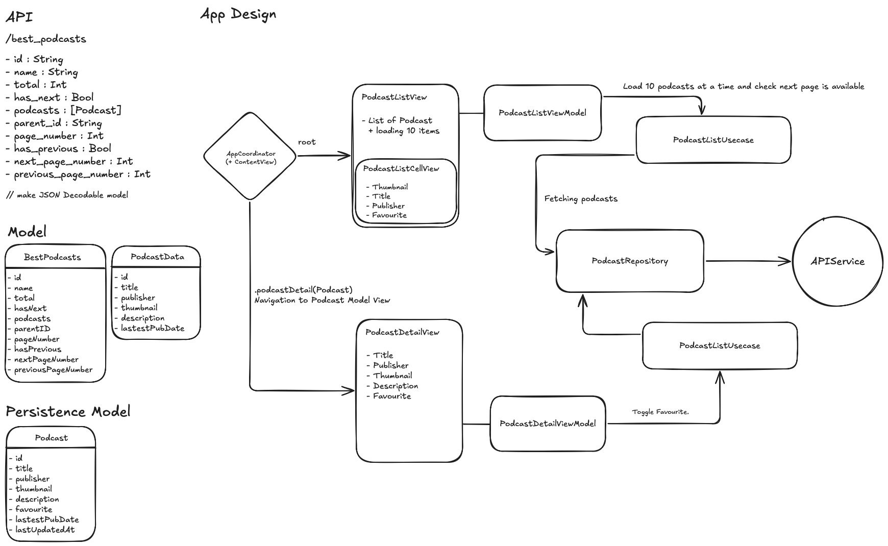

# Podcasts App

- Issue : 🧐 The mock data is not refreshing or providing new content when navigating to the next page.
```
Error loading podcasts: fetchNoMoreData
```
## 📐 Design

The app was designed based on the following mockup specifications:



### Design Requirements
- **Screen 1**: List view with podcast thumbnails, titles, publishers, and favorite indicators
- **Screen 2**: Detail view with comprehensive podcast information and favorite toggle
- **Navigation**: Seamless transition between list and detail views
- **Pagination**: 10 items per page with infinite scroll
- **Favorites**: Persistent favorite state with visual indicators

## Features

### 📱 Core Functionality
- **Podcast List**: Browse podcasts with thumbnails, titles, and publishers
- **Infinite Scroll**: Load 10 podcasts per page with seamless pagination
- **Podcast Details**: View comprehensive podcast information
- **Favorites**: Mark podcasts as favorites with persistent storage
- **Search by Genre**: Browse podcasts by specific genres

### 🎨 User Interface
- **Modern Design**: Clean, native iOS interface using SwiftUI
- **Responsive Layout**: Optimized for portrait orientation
- **Loading States**: Smooth loading indicators and error handling
- **Navigation**: Intuitive navigation between list and detail views

## Architecture

This app follows **MVVM (Model-View-ViewModel)** architecture with additional patterns:

### 🏗️ Architecture Patterns
- **MVVM**: Separation of concerns between UI and business logic
- **Repository Pattern**: Data access abstraction
- **Use Case Pattern**: Business logic encapsulation
- **Coordinator Pattern**: Navigation management

### 📁 Project Structure
```
podcasts/
├── Core/
│   ├── ContentView.swift          # Main navigation container
│   ├── podcastsApp.swift          # App entry point
│   ├── Coordinators/
│   │   └── AppCoordinator.swift   # Navigation coordinator
│   └── Persistence/
│       ├── Persistence.swift      # SwiftData persistence
│       └── SchemaVersion100.swift # SwiftData schema
├── Data/
│   ├── Models/
│   │   ├── Podcast.swift          # Swiftdata Podcast model
│   │   └── BestPodcasts.swift     # API response model
│   └── Repositories/
│       └── PodcastRepository.swift # Data access layer
├── Presentation/
│   ├── PodcastList/
│   │   ├── PodcastListView.swift      # Main list view
│   │   ├── PodcastListCellView.swift  # Individual cell
│   │   └── PodcastListViewModel.swift # List view model
│   └── PodcastDetail/
│       ├── PodcastDetailView.swift      # Detail view
│       └── PodcastDetailViewModel.swift # Detail view model
├── Services/
│   └── APIService.swift           # Listen Notes API integration
└── Usecase/
    ├── PodcastListUsecase.swift   # List business logic
    └── PodcastDetailUsecase.swift # Detail business logic
```

## Technical Details

### 🔧 Technologies Used
- **SwiftUI**: Modern declarative UI framework
- **SwiftData**: Local data persistence
- **AsyncImage**: Asynchronous image loading
- **NavigationStack**: Programmatic navigation

### 📊 Data Flow
1. **API Integration**: Fetch podcasts from Listen Notes API
2. **Local Storage**: Cache data using SwiftData
3. **Pagination**: Smart pagination (API: 20 items, UI: 10 items)
5. **Navigation**: Coordinator pattern for navigation

### 🔄 Pagination Strategy
The app implements a sophisticated pagination system:
- **API Level**: 20 podcasts per request
- **UI Level**: 10 podcasts per page
- **Caching**: Smart cache management for performance
- **Infinite Scroll**: Automatic loading when reaching the end

## API Integration

### 🌐 Listen Notes API
- **Endpoint**: `https://www.listennotes.com/api/docs/`


## Getting Started

### 📋 Prerequisites
- iOS 17.0+
- Swift 5.9+

### 🚀 Installation
1. Clone the repository
2. Open `podcasts.xcodeproj` in Xcode
3. Build and run the project
4. No additional setup required (uses mock data)

### 🏃‍♂️ Running the App
1. Launch the app
2. Browse the podcast list
3. Tap on any podcast to view details
4. Use the favorite button to mark podcasts
5. Scroll down to load more podcasts

## Features Explained

### 💾 Persistent Favorites
```swift
func toggleFavourite(podcastId: String) async throws {
    // SwiftData automatically persists changes
    podcast.favourite.toggle()
    try context.save()
}
```

## Error Handling

### 🛡️ Error Management
- **Network Errors**: Graceful API failure handling
- **Data Validation**: Input sanitization
- **User Feedback**: Clear error messages
- **Fallback States**: Default images and content

## Future Enhancements

### 🔮 Potential Improvements
- **Search Functionality**: Search podcasts by title/publisher
- **Offline Support**: Enhanced offline capabilities
- **Push Notifications**: New episode notifications
- **User Profiles**: Personalized recommendations
- **Social Features**: Share and rate podcasts

## Contributing

## Acknowledgments
- **Listen Notes**: For providing the podcast API
- **Apple**: For SwiftUI and SwiftData frameworks
---

**Built with ❤️ using SwiftUI and SwiftData**
